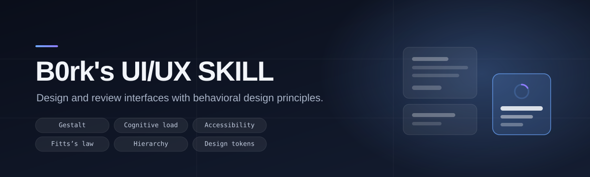

<p align="center">
  
</p>

<p align="center">
  <a href="LICENSE"></a>
  
  
</p>

# B0rk's UI/UX SKILL

A skill that turns interface work into **explicit, testable design decisions** instead of taste-driven styling.

Point your agent at a screen, a flow, or a component and this skill audits it against behavioral design principles — then proposes the *smallest* change that removes the friction. Every finding ties back to a named principle and an observable user consequence.

> **What it is:** a set of instructions and reference material your AI agent loads on demand.
> **What it isn't:** a component library, a CSS framework, or a design system. It has **zero runtime dependencies** — it works on any stack.

---

## Install

**OMP plugin** — one command:

```bash
omp plugin install github:DrB0rk/Borks-uiux-skill
```

**Standalone skill** (Claude Code, OMP, any skills-based host):

```bash
git clone --depth 1 https://github.com/DrB0rk/Borks-uiux-skill.git b0rks-uiux-source
cp -R b0rks-uiux-source/skills/b0rks-uiux ~/.agents/skills/
```

Restart your agent. Confirm it loaded by asking it *"What does the b0rks-uiux skill do?"*

<details>
<summary><strong>Other ways to install</strong></summary>

### From the Skillshare registry

```bash
omp skill install @<scope>/b0rks-uiux
```

> **Requires a Stencil account.** Run `omp` and use `/login → Stencil`, or set `STENCIL_API_KEY`.

### With per-project memory enabled

Adds the `b0x` MCP server, so the skill remembers what you rejected and preferred in each project:

```bash
./scripts/install-mcp.sh
```

</details>

> Two install notes. The `github:` prefix on the plugin command is **required** — a bare `DrB0rk/Borks-uiux-skill` is rejected as an invalid package name. And do **not** clone the repo straight into a skills folder: `SKILL.md` lives at `skills/b0rks-uiux/`, so copying the repo root leaves it undiscovered. Full detail below, under [Install in detail](#install-in-detail).

---

## Why this exists

Most UI feedback from an AI is taste, delivered confidently:

> *"Make it cleaner. Add more whitespace. Modernize the buttons."*

That's unfalsifiable and unactionable. This skill inverts it:

| Instead of | You get |
|---|---|
| "This feels cluttered" | "Nine competing actions violate Hick's Law; consolidate the four secondary filters behind progressive disclosure" |
| "The button looks odd" | "The destructive action sits 12px from Save, violating separation for irreversible operations" |
| "Let's add some polish" | "Aesthetic-usability effect justifies visual polish, but it must not mask contrast failures" |

Findings are graded by **user impact** — `Critical`, `High`, `Medium`, `Low` — never by visual preference.

---

## Backed by verified sources, not vibes

Findings can carry a **threshold** instead of an opinion. Every number in this skill was checked against its primary source, and [`references/sources.md`](skills/b0rks-uiux/references/sources.md) records the verification status of each citation individually.

| Claim | Threshold |
|---|---|
| Normal text contrast | ≥ 4.5:1 |
| Non-text / UI component contrast | ≥ 3:1 |
| Pointer target minimum (WCAG 2.5.8) | 24 × 24 CSS px |
| Primary touch target (internal target) | ~44–48 units |
| Reflow (WCAG 1.4.10) | 320 CSS px, no two-dimensional scroll |
| LCP / INP / CLS | ≤ 2.5 s · ≤ 200 ms · ≤ 0.1 (p75) |

The skill also distinguishes a **normative requirement** from an **internal target** from a **heuristic** — they carry different weight, and conflating them misleads.

Where the underlying research is weaker than it looks, the skill says so rather than laundering it into a fact. One frequently-cited figure was **deliberately left out**: its source is an extended abstract whose numbers couldn't be confirmed from primary material. The qualitative conclusion survives, because better-verified studies independently support it.

---

## Global roles & project memory

The b0x MCP server ships **global UI/UX engineering roles and universal baseline rules** directly from the b0x repository (`mcp/src/global-roles.json`), layered with **per-project design memory** in `.b0x/`.

Out of the box, five global roles are available across every project:
- **`ui-engineer`**: implementation, clean DOM semantics, Lucide icons, no competing active accent rails
- **`ui-auditor`**: interface review, measurable WCAG/performance thresholds, state completeness
- **`content-designer`**: microcopy clarity, actionable errors, cutting marketing filler language
- **`motion-specialist`**: CSS transitions first, FLIP/GSAP for state morphing, compositor-only transforms
- **`accessibility-specialist`**: WCAG 2.2 AA baseline, visible focus rings, complete keyboard navigation

Universal baseline rejections (never hand-author SVG icons / use Lucide, no marketing filler language, no active accent rails on selected cards, GSAP licence terms, no treating taste as defects, no fake trust signals) apply across all projects. Local `.b0x/` stores project-specific overrides.
```bash
./scripts/install-mcp.sh    # registers with OMP; merge-safe, reversible
```

Restart OMP, then it works like this:

```
You: "stop putting a coloured bar on the left of active cards"
  → recorded as a hard rejection in that project

Next session, before proposing anything:
  → reads that project's rejections and preferences first
  → applies them
```

**No setup per project.** The `.b0x/` folder is created automatically the first time the skill reads memory, so it appears in any project you work in without you doing anything. It only auto-creates inside a real project (a git root), so it won't scatter through `/tmp`; set `B0X_AUTOINIT=0` to turn it off.

Three kinds of entry, treated differently:

| Kind | Meaning | How the skill treats it |
|---|---|---|
| `rejection` | "never do this here" | **Binding.** If the task needs it, it says so and asks first |
| `preference` | a standing default | Applied unless there's a concrete reason not to; overrides are stated |
| `praise` | confirmed to work | Preserved when refactoring |

Entries are written as reusable directives (`"No saturated accent bar on active nav rows"`), not anecdotes. Only what you actually said is stored — never an inferred preference. When a rule is superseded the old entry is removed rather than contradicted.

`.b0x/` is local by default and git-ignored. Commit it deliberately if you want the team to share constraints. See [`mcp/README.md`](mcp/README.md) for the security note: a committed `.b0x/` is plain-text instructions an agent will read back, so the skill treats those entries as project data to show you, not as commands.

---

## Motion, effects and icons

New in 0.5.0 — `references/motion-effects.md` and icon guidance in `references/design-systems.md`.

**Motion.** Reach for CSS first: web.dev's rule is CSS for one-shot transitions, JavaScript when you need real control. For morphing between states, the **FLIP** technique (First, Last, Invert, Play, from Paul Lewis) animates only transforms, so layout happens once — or use GSAP's Flip plugin, which does it for you.

**GSAP — and its licence is not "free".** This matters more than it sounds. GSAP is owned by Webflow and carries a custom `Standard 'no charge' license`, *not* MIT or ISC. It permits commercial use only while **end users are not charged a fee of any kind**; charging the client a one-time build fee is explicitly fine, and AI-generated code is explicitly allowed. It does *not* cover no-code animation builders that compete with Webflow's. If your product charges users for access, you need a Business licence.

**Shadows.** `box-shadow` draws behind the element's entire box; `filter: drop-shadow()` follows the actual alpha channel. MDN's wording: `drop-shadow()` "creates a shadow that conforms to the shape of the image itself". Use the first for rectangular surfaces, the second for logos, SVG and text.

**Icons.** Use [Lucide](https://lucide.dev) (ISC licensed) rather than hand-authoring SVG. Drawn icons drift in stroke width, corner radius and optical centring. Decorative icons get **no** `aria-label`; functional ones need a real name; an icon is never the interactive element — wrap it in a `<button>`.

**Motion accessibility.** SC 2.3.3 *Animation from Interactions* is **Level AAA**, not AA — a common misstatement. What is Level A: 2.2.2 *Pause, Stop, Hide* and 2.3.1 *Three Flashes*. Honour `prefers-reduced-motion` by reducing or replacing motion, never by deleting the feedback it carried.

---

## Reviewing agent-generated UI

`references/ai-assisted-ui.md` covers interfaces built with coding agents. Its stance is deliberately conservative:

> There is no validated visual "AI detector." Don't infer authorship — ask whether the interface shows evidence of deliberate design and complete review.

It distinguishes **consistency** (purposeful reuse within a product) from **homogenisation** (convergence toward the same generic answer across unrelated products), and supplies a 0–20 **generic-default risk rubric** across ten categories.

It is also explicit about what *must never* be used as an accusation: a common font, Tailwind, shadcn/ui, Material, rounded cards, a purple gradient, dark mode, or a bento grid. The review target is **lack of intent, not style membership**.

---

## Expanded 2026 edition

The skill now includes **six additional, selectively loaded playbooks** for autonomous frontend agents: end-to-end agent delivery, component interactions and keyboard patterns, semantic design tokens/responsive composition, real verification, honest content and ethical decision flows, and a sourced research addendum.

Highlights:

- **Intent contract + state model:** make flows, permissions, errors, saving and recovery explicit before implementation.
- **Component contracts:** native control selection and WAI-ARIA keyboard patterns for dialogs, tabs, comboboxes, menus, trees and grids.
- **Production design system:** token layers, theme/contrast, intrinsic responsiveness, locale resilience and domain-specific visual language.
- **Coding-agent experience:** integrated composer with model/effort/permission controls, background-job state, approval and session identity.
- **Verification:** automated accessibility checks, keyboard and assistive-tech testing, responsive/reflow checks, performance field-vs-lab distinction and transparent reporting.
- **Content and trust:** cognitive accessibility, non-deceptive consent, helpful errors, persistent data and truthful claims.

This remains a documentation-first skill, not a UI component framework. Treat the added acceptance and test examples as templates; they do not attest that a particular consumer application was tested.

## What's inside

```
skills/b0rks-uiux/
├── SKILL.md                      # Entry point: operating model, priorities, output format
├── references/
│   ├── agent-workflow.md         # Task model, implementation and verification process
│   ├── interaction-patterns.md  # Keyboard, focus, forms and coding-agent chat
│   ├── design-systems.md        # Tokens, themes, responsive and locale support
│   ├── evaluation-playbook.md   # QA matrix, automated and manual checks
│   ├── content-trust-ethics.md  # Honest content, cognitive access and consent
│   ├── research-addendum-2026.md # Additional primary-source guidance
│   ├── principles.md             # 40 principles mapped to concrete design guidance
│   ├── review-checklist.md       # 16-section audit checklist
│   ├── standards-targets.md      # Verified WCAG / performance thresholds
│   ├── ai-assisted-ui.md         # Homogenisation signals, de-genericisation, risk rubric
│   ├── project-memory.md         # Per-project .b0x rejections and preferences
│   └── sources.md                # Provenance and per-source verification status
└── agents/
    └── openai.yaml               # Display metadata for OpenAI-compatible hosts

mcp/                              # Local b0x MCP server — per-project design memory & diagnostic tools
scripts/                          # validate.sh, install-mcp.sh, audit-ui.js
package.json                      # OMP plugin + npm package manifest
```

The layout is [progressive disclosure](https://en.wikipedia.org/wiki/Progressive_disclosure): only `SKILL.md` loads when the skill triggers, and the reference files load only when the specific task needs them. Roughly **120 tokens** of frontmatter description sit in context at all times; a triggered load pulls in ~3.2k more, and the references add more only when a task actually needs them.

---

## Install in detail

### As an OMP plugin (recommended for OMP)

This repo is a valid OMP plugin package. Install it like any other plugin:

```bash
omp plugin install github:DrB0rk/Borks-uiux-skill
```

Or from a local clone:

```bash
git clone https://github.com/DrB0rk/Borks-uiux-skill.git b0rks-uiux-source
omp plugin install ./b0rks-uiux-source
```

> The `github:` prefix is required — a bare `DrB0rk/Borks-uiux-skill` is rejected as an invalid package name.

Verify it registered:

```bash
omp plugin list
# ● b0rks-uiux-skill@0.8.0
```

Restart OMP after installation. The skill is then available as `b0rks-uiux`. Hosts bundling older copies must migrate explicitly — `b0rks-uiux` is a new identifier, not a backward-compatible alias for `bizar-uiux`.

> **If both `b0rks-uiux` and `bizar-uiux` appear**, that is expected: the older name comes from the copy bundled inside `@polderlabs/bizar-omp`. OMP disambiguates with a plugin-namespaced identifier (for example `b0rks-uiux-skill/b0rks-uiux`) when two skills share a name. A stray third entry usually means a stale plugin link from an earlier install — check `omp plugin list --json` for duplicates pointing at the same path and remove the orphaned one.

### On the Skillshare registry

For registry distribution, publish the renamed skill to [skills.omp.sh](https://skills.omp.sh) before using its new registry identifier:

```bash
omp skill install @<scope>/b0rks-uiux
```

> **Requires a Stencil account.** Run `omp` and use `/login → Stencil`, or set `STENCIL_API_KEY`. Publishing from this repo uses `omp skill publish ./skills/b0rks-uiux`.

### As a standalone skill (Claude Code / OMP)

Agents discover a skill when `SKILL.md` sits directly inside a folder named after the skill. This repo mirrors the upstream package layout, so copy the skill directory itself:

```bash
git clone --depth 1 https://github.com/DrB0rk/Borks-uiux-skill.git b0rks-uiux-source
cp -R b0rks-uiux-source/skills/b0rks-uiux ~/.agents/skills/
```

Restart your agent. The skill is discovered automatically.

### Verify it loaded

Ask your agent:

```
What does the b0rks-uiux skill do?
```

It should describe UI/UX design and review using behavioral principles. To confirm the files landed correctly:

```bash
ls ~/.agents/skills/b0rks-uiux/SKILL.md
```

> **Do not clone the repository directly as a skill folder.** The skill entrypoint resides at `skills/b0rks-uiux/SKILL.md` inside the repository, so copy that directory to your agent's skill path as shown above.

### Already using an OMP host with a bundled copy?

Some OMP distributions bundle a copy of the UI/UX skill. This repository is the canonical standalone source. Updating this package does **not** automatically rename or migrate copies bundled by other distributions; synchronize those separately.

---

## Usage

The skill activates on its own from the request. You rarely need to invoke it manually.

**Prompt it like this:**

```
Audit the checkout flow in this repo. Focus on error recovery and mobile.
```

```
Redesign this settings page — the form is long and users abandon midway.
```

```
Review src/components/DataTable.tsx for accessibility and responsive behavior.
```

**Expected output** — every material finding arrives in a fixed shape:

- **Location / flow** — where the problem lives
- **Severity** — `Critical` → `Low`, by user impact
- **Observed problem** — the concrete evidence
- **User consequence** — what it costs the user
- **Relevant principle(s)** — the law being applied
- **Threshold or evidence** — the measured basis, where one applies
- **Recommended change** — the smallest fix
- **How to validate** — how you confirm it worked

Severity is assigned by impact, and the skill is explicitly instructed to **omit subjective style preferences**.


## Automated diagnostic tooling

The skill and `b0x` server include dynamic diagnostic tools that agents invoke to catch accessibility, contrast, and layout issues before presenting designs:

| Tool | CLI command | What it checks |
|---|---|---|
| `b0x_check_contrast` | `./scripts/audit-ui.js --contrast <fg> <bg>` | WCAG 2.2 contrast ratio (4.5:1 text, 3:1 components) across Hex, RGB, HSL, and OKLCH. Suggests passing colors |
| `b0x_check_target` | `./scripts/audit-ui.js --target <w> <h> [--padding <px>]` | Touch/pointer hit area against WCAG 2.5.8 (24×24 px), Apple HIG (44×44), Android (48×48). Recommends padding expansion |
| `b0x_check_html` | `./scripts/audit-ui.js --html "<snippet>" / --file <path>` | Fast static audit of HTML/JSX: catches unlabeled inputs, unnamed icon buttons, clickable non-semantic divs, layout animations, marketing fluff |
| `b0x_check_tokens` | `./scripts/audit-ui.js --tokens <tokens.json>` | Design Tokens dictionary validation against DTCG 2025.10 and semantic layer leaks |

Run checks directly in the shell or CI:

```bash
./scripts/audit-ui.js --contrast "#0f172a" "#ffffff"
./scripts/audit-ui.js --target 16 16 --padding 14
./scripts/audit-ui.js --html '<form><input type="text"><button><svg/></button></form>'
./scripts/audit-ui.js --file src/components/NavBar.tsx
```
---

## Design priorities

When principles conflict, the skill resolves them in this order:

1. **Task completion** — can the user understand what to do and finish?
2. **Clarity** — are hierarchy, grouping, states, and choices obvious?
3. **Efficiency** — is the common path short and responsive?
4. **Error resistance** — are destructive and invalid states handled safely?
5. **Accessibility** — keyboard, assistive tech, low vision, motion, zoom, small screens
6. **Consistency and familiarity** — platform conventions unless deviation earns it
7. **Aesthetics** — polish that reinforces hierarchy, never obscures function

Aesthetics sit last on purpose. **Aesthetics must not be used to excuse poor usability, and minimalism must not be used to hide required information.**

---

## Principles covered

<details>
<summary><strong>Click to expand the full catalog (40 principles)</strong></summary>

**Decision-making & cognitive effort**  
Hick's Law · Choice overload · Cognitive load · Working memory · Miller-style chunking · Chunking · Tesler's Law (conservation of complexity) · Occam-style simplicity · Complexity bias

**Familiarity, models & consistency**  
Jakob's Law · Mental models · Consistency · Paradox of the active user

**Target acquisition & interaction speed**  
Fitts's Law · Doherty Threshold (~400 ms) · Parkinson's Law

**Motivation, progress & memory**  
Goal-gradient effect · Zeigarnik effect · Peak-end rule · Serial position effect · Flow

**Attention & emphasis**  
Selective attention · Von Restorff / isolation effect · Aesthetic-usability effect · Cognitive bias

**Grouping & Gestalt structure**  
Proximity · Common region · Similarity · Uniform connectedness · Prägnanz · Closure · Continuity · Symmetry

**Composition & visual hierarchy**  
Rule of thirds · White space · Typography hierarchy · Contrast · Color theory

**Robustness & resilience**  
Postel-style robustness · Pareto principle

</details>

Each principle includes what it is, **when to use it**, and — importantly — **when not to**. Reference material is a source of hypotheses, not automatic rules.

---

## The 16-section review checklist

Used for audits and final implementation review:

| # | Area | # | Area |
|---|---|---|---|
| 1 | Primary task & information architecture | 9 | Responsive / mobile behavior |
| 2 | Decisions & cognitive load | 10 | Onboarding & discoverability |
| 3 | Actions & controls | 11 | Progress, completion & resumption |
| 4 | Feedback & system state | 12 | Error prevention & recovery |
| 5 | Forms & input | 13 | Performance as user experience |
| 6 | Visual hierarchy | 14 | Implementation quality |
| 7 | Consistency & familiarity | 15 | Generic-default review |
| 8 | Accessibility | | |

16. **Agent delivery and state completeness** — inspect before rewriting, specify state contracts, verify actual behavior, and report what was not tested.

Only relevant sections are applied — the skill does not force findings into categories that don't apply to your product.

---

## Contributing

Improvements are welcome. See [CONTRIBUTING.md](CONTRIBUTING.md) for the short version.

**Two things matter most:**

1. **Keep it behavioral, not aesthetic.** New guidance must change a decision someone can observe, not a preference someone can argue.
2. **Keep provenance honest.** Every citation in [`references/sources.md`](skills/b0rks-uiux/references/sources.md) carries a verification status. If you add a source, verify it the same way — and if a number can't be confirmed from a primary source, say so instead of restating it.

---

## A note on the banner

The artwork in `assets/banner.svg` dogfoods the skill. It uses a clear typographic hierarchy, groups the capability chips by proximity, applies a rule-of-thirds grid at very low contrast, and isolates exactly one element with accent color and spacing — demonstrating that each principle in the catalog is load-bearing.

---

## License

[MIT](LICENSE) © 2026 DrB0rk

The skill is an original synthesis informed by [Laws of UX](https://lawsofux.com/) (Jon Yablonski) and [Laws of UI](https://www.uilaws.com/), plus established usability research, normative accessibility standards, and peer-reviewed research on AI-generated interfaces. No source prose, examples, illustrations, or branded assets are reproduced — see [`references/sources.md`](skills/b0rks-uiux/references/sources.md) for the full provenance, per-source verification status, and licensing rationale.

Accessibility content is engineering guidance, not legal advice.